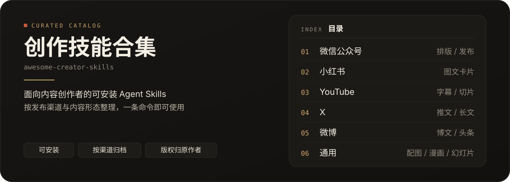
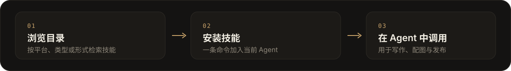

<!-- Generated by scripts/generate-readme.ts. Do not edit by hand. -->

<p align="center">
  
</p>

# 创作技能合集

面向内容创作者的 Agent Skills **精选目录**。每一项都可直接安装到 Cursor、Claude Code 等环境，并按发布渠道与内容形态检索。

当前收录 **13** 个技能，覆盖微信公众号、小红书、YouTube、X、微博。

内容形态包括文章、图片、图文、视频、幻灯片、漫画、信息图。

```bash
npx skills add BigPengSays/awesome-creator-skills --skill <skill-id>
```

<p align="center">
  
</p>

## 按平台

#### 微信公众号

- [baoyu-post-to-wechat](skills/baoyu-post-to-wechat/) [](https://github.com/JimLiu/baoyu-skills) — 发布微信公众号文章与贴图
- [md2wechat](skills/md2wechat/) [](https://github.com/geekjourneyx/md2wechat-skill) — Markdown 转微信公众号排版

#### 小红书

- [baoyu-xhs-images](skills/baoyu-xhs-images/) [](https://github.com/JimLiu/baoyu-skills) — 生成小红书图文卡片
- [xhs-visual-director](skills/xhs-visual-director/) [](https://github.com/ziguishian/xhs-visual-director-skill) — 规划与审阅小红书图文的视觉方向

#### YouTube

- [baoyu-youtube-transcript](skills/baoyu-youtube-transcript/) [](https://github.com/JimLiu/baoyu-skills) — 下载 YouTube 字幕与封面
- [youtube-clipper](skills/youtube-clipper/) [](https://github.com/op7418/youtube-clipper-skill) — YouTube 视频切片

#### X

- [baoyu-post-to-x](skills/baoyu-post-to-x/) [](https://github.com/JimLiu/baoyu-skills) — 发布推文与 X Articles

#### 微博

- [baoyu-post-to-weibo](skills/baoyu-post-to-weibo/) [](https://github.com/JimLiu/baoyu-skills) — 发布微博与头条文章

#### 通用

- [baoyu-article-illustrator](skills/baoyu-article-illustrator/) [](https://github.com/JimLiu/baoyu-skills) — 为文章配图
- [baoyu-comic](skills/baoyu-comic/) [](https://github.com/JimLiu/baoyu-skills) — 生成知识漫画
- [baoyu-cover-image](skills/baoyu-cover-image/) [](https://github.com/JimLiu/baoyu-skills) — 生成文章封面图
- [baoyu-infographic](skills/baoyu-infographic/) [](https://github.com/JimLiu/baoyu-skills) — 生成高密度信息图
- [baoyu-slide-deck](skills/baoyu-slide-deck/) [](https://github.com/JimLiu/baoyu-skills) — 生成幻灯片

## 按创作类型

#### 文章

- [baoyu-article-illustrator](skills/baoyu-article-illustrator/) [](https://github.com/JimLiu/baoyu-skills) — 为文章配图
- [baoyu-post-to-wechat](skills/baoyu-post-to-wechat/) [](https://github.com/JimLiu/baoyu-skills) — 发布微信公众号文章与贴图
- [baoyu-post-to-weibo](skills/baoyu-post-to-weibo/) [](https://github.com/JimLiu/baoyu-skills) — 发布微博与头条文章
- [baoyu-post-to-x](skills/baoyu-post-to-x/) [](https://github.com/JimLiu/baoyu-skills) — 发布推文与 X Articles
- [md2wechat](skills/md2wechat/) [](https://github.com/geekjourneyx/md2wechat-skill) — Markdown 转微信公众号排版

#### 图片

- [baoyu-article-illustrator](skills/baoyu-article-illustrator/) [](https://github.com/JimLiu/baoyu-skills) — 为文章配图
- [baoyu-cover-image](skills/baoyu-cover-image/) [](https://github.com/JimLiu/baoyu-skills) — 生成文章封面图
- [baoyu-xhs-images](skills/baoyu-xhs-images/) [](https://github.com/JimLiu/baoyu-skills) — 生成小红书图文卡片
- [xhs-visual-director](skills/xhs-visual-director/) [](https://github.com/ziguishian/xhs-visual-director-skill) — 规划与审阅小红书图文的视觉方向

#### 图文

- [baoyu-post-to-wechat](skills/baoyu-post-to-wechat/) [](https://github.com/JimLiu/baoyu-skills) — 发布微信公众号文章与贴图
- [baoyu-post-to-weibo](skills/baoyu-post-to-weibo/) [](https://github.com/JimLiu/baoyu-skills) — 发布微博与头条文章
- [baoyu-xhs-images](skills/baoyu-xhs-images/) [](https://github.com/JimLiu/baoyu-skills) — 生成小红书图文卡片
- [xhs-visual-director](skills/xhs-visual-director/) [](https://github.com/ziguishian/xhs-visual-director-skill) — 规划与审阅小红书图文的视觉方向

#### 视频

- [baoyu-youtube-transcript](skills/baoyu-youtube-transcript/) [](https://github.com/JimLiu/baoyu-skills) — 下载 YouTube 字幕与封面
- [youtube-clipper](skills/youtube-clipper/) [](https://github.com/op7418/youtube-clipper-skill) — YouTube 视频切片

#### 幻灯片

- [baoyu-slide-deck](skills/baoyu-slide-deck/) [](https://github.com/JimLiu/baoyu-skills) — 生成幻灯片

#### 漫画

- [baoyu-comic](skills/baoyu-comic/) [](https://github.com/JimLiu/baoyu-skills) — 生成知识漫画

#### 信息图

- [baoyu-infographic](skills/baoyu-infographic/) [](https://github.com/JimLiu/baoyu-skills) — 生成高密度信息图
- [baoyu-xhs-images](skills/baoyu-xhs-images/) [](https://github.com/JimLiu/baoyu-skills) — 生成小红书图文卡片

## 按创作形式

#### 教程

- [baoyu-youtube-transcript](skills/baoyu-youtube-transcript/) [](https://github.com/JimLiu/baoyu-skills) — 下载 YouTube 字幕与封面
- [youtube-clipper](skills/youtube-clipper/) [](https://github.com/op7418/youtube-clipper-skill) — YouTube 视频切片

#### 叙事

- [baoyu-comic](skills/baoyu-comic/) [](https://github.com/JimLiu/baoyu-skills) — 生成知识漫画

## 安装

安装单个技能：

```bash
npx skills add BigPengSays/awesome-creator-skills --skill baoyu-post-to-wechat
```

安装全部技能：

```bash
npx skills add BigPengSays/awesome-creator-skills --skill '*'
```

## 版权归属

技能版权仍归原作者。本仓库目录与脚本采用 MIT 许可，各技能保留其上游许可证。详见各技能目录中的 `SOURCE.md`，以及：

- https://github.com/JimLiu/baoyu-skills
- https://github.com/geekjourneyx/md2wechat-skill
- https://github.com/op7418/youtube-clipper-skill
- https://github.com/ziguishian/xhs-visual-director-skill
