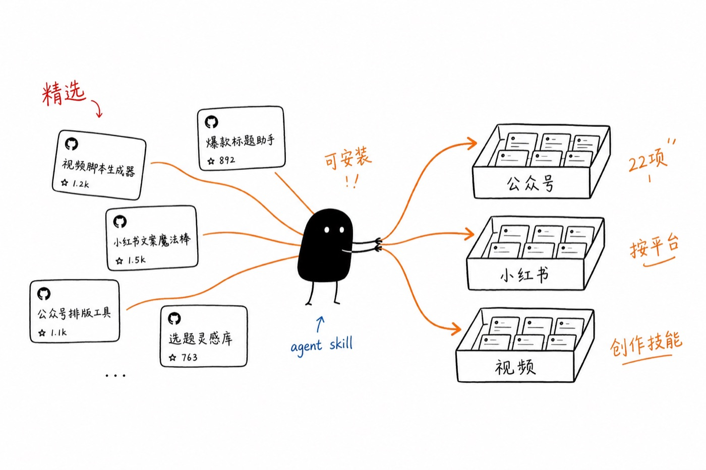

<!-- Generated by scripts/generate-readme.ts. Do not edit by hand. -->

<h1 align="center">内容创作者 Skill 精选大合集</h1>

<p align="center">
<a href="https://github.com/BigPengSays"></a>
<a href="https://github.com/BigPengSays/awesome-creator-skills"></a>
<a href="https://github.com/BigPengSays/awesome-creator-skills/blob/main/LICENSE"></a>
</p>

<p align="center">
  
</p>

面向内容创作的 **Agent Skills** 精选合集。每个 skill 入库前都经过人工筛选与验证，多数也是维护者日常在用的工具——不是 star 排行榜，而是可以直接装进 Agent 的创作工作流。

- **平台覆盖：** 微信公众号 · 小红书 · YouTube · X (Twitter) · LinkedIn · 哔哩哔哩
- **内容形态：** 文章 · 图片 · 图文 · 视频 · 幻灯片 · 漫画 · 信息图
- **当前收录：** **43** 个精选 skill，[持续更新中](CONTRIBUTING.md)

## 快速开始

支持 [Cursor](https://cursor.com)、[Claude Code](https://docs.anthropic.com/en/docs/claude-code) 等 Agent 环境，一条命令即可安装：

```bash
npx skills add BigPengSays/awesome-creator-skills --skill <skill-id>
```

安装全部 skill 或查看其他安装方式，见下方 [安装](#安装) 章节。

---

发现好用的创作 skill？[欢迎投稿](CONTRIBUTING.md) · 提 Issue 或 PR

## 目录

**[按平台](#按平台)**

> [微信公众号](#微信公众号) · [小红书](#小红书) · [YouTube](#youtube) · [X (Twitter)](#x-twitter) · [LinkedIn](#linkedin) · [哔哩哔哩](#哔哩哔哩) · [通用](#通用)

**[按创作类型](#按创作类型)**

> [文章](#文章) · [图片](#图片) · [图文](#图文) · [视频](#视频) · [幻灯片](#幻灯片) · [漫画](#漫画) · [信息图](#信息图)

**[按创作形式](#按创作形式)**

> [白板视频](#白板视频) · [口播视频](#口播视频) · [教程](#教程) · [叙事](#叙事)

**[内容发布](#内容发布)**

**[安装](#安装)**

**[版权归属](#版权归属)**


## 按平台

#### 微信公众号

- [khazix-writer](https://github.com/KKKKhazix/khazix-skills/tree/main/khazix-writer) [](https://github.com/KKKKhazix/khazix-skills) — 按卡兹克公众号口吻与节奏写长文，含禁忌词、四层自检与风格示例库。
- [baoyu-markdown-to-html](https://github.com/JimLiu/baoyu-skills/tree/main/skills/baoyu-markdown-to-html) [](https://github.com/JimLiu/baoyu-skills) — 把 Markdown 转为带微信主题的 styled HTML，支持代码高亮、数学、PlantUML 与脚注。
- [guizang-social-card-skill](https://github.com/op7418/guizang-social-card-skill) [](https://github.com/op7418/guizang-social-card-skill) — 生成归藏风格小红书图文、Live Photo 实况拼图与公众号封面组，支持杂志风与瑞士国际主义两种视觉体系。
- [gzh-design](https://github.com/isjiamu/gzh-design-skill) [](https://github.com/isjiamu/gzh-design-skill) — 把 Markdown、Word、PDF 或纯文本排成可直接粘贴进公众号编辑器的 HTML，支持多主题、自动章节编号与一键预览复制。
- [guizang-material-illustration](https://github.com/op7418/guizang-material-illustration) [](https://github.com/op7418/guizang-material-illustration) — 从文章、笔记或图表数据生成归藏风格带字插图与解释图，适合公众号、小红书、汇报与教程配图。
- [ip-illustration-character-system](https://github.com/EverettFish/ip_illustration_for_yourself) [](https://github.com/EverettFish/ip_illustration_for_yourself) — 用照片建立可复用的萌粒风格个人 IP，并为长文生成留白多的 mini 插图与 3:4 信息图，保持角色一致。
- [oil-tone](https://github.com/oil-oil/oil-tone/tree/main/skills/oil-tone) [](https://github.com/oil-oil/oil-tone) — 为 oil 本人成稿提供可朗读、平实直叙的中英文文风规范，避免 AI 味、模板化表达与拔高立意。

#### 小红书

- [baoyu-xhs-images](https://github.com/JimLiu/baoyu-skills/tree/main/skills/baoyu-xhs-images) [](https://github.com/JimLiu/baoyu-skills) — 把内容拆成 1–10 张卡通信息卡片，提供 12 种风格与 8 种版式，针对小红书种草与图文笔记。
- [guizang-social-card-skill](https://github.com/op7418/guizang-social-card-skill) [](https://github.com/op7418/guizang-social-card-skill) — 生成归藏风格小红书图文、Live Photo 实况拼图与公众号封面组，支持杂志风与瑞士国际主义两种视觉体系。
- [xhs-visual-director](https://github.com/ziguishian/xhs-visual-director-skill/tree/main/skill) [](https://github.com/ziguishian/xhs-visual-director-skill) — 以视觉导演而不是文案助手的方式规划小红书图文：封面、3:4 与轮播分页构图、生图提示词、风格一致性与标题标签。
- [guizang-material-illustration](https://github.com/op7418/guizang-material-illustration) [](https://github.com/op7418/guizang-material-illustration) — 从文章、笔记或图表数据生成归藏风格带字插图与解释图，适合公众号、小红书、汇报与教程配图。
- [ip-illustration-character-system](https://github.com/EverettFish/ip_illustration_for_yourself) [](https://github.com/EverettFish/ip_illustration_for_yourself) — 用照片建立可复用的萌粒风格个人 IP，并为长文生成留白多的 mini 插图与 3:4 信息图，保持角色一致。
- [oil-cover](https://github.com/oil-oil/oil-cover) [](https://github.com/oil-oil/oil-cover) — 生成小红书和 B 站 AI 工具实操视频封面，支持脚本模式与 Agent 自主模式、真实视频证据、三画幅输出和可选创作者头像。
- [oil-tone](https://github.com/oil-oil/oil-tone/tree/main/skills/oil-tone) [](https://github.com/oil-oil/oil-tone) — 为 oil 本人成稿提供可朗读、平实直叙的中英文文风规范，避免 AI 味、模板化表达与拔高立意。

#### YouTube

- [baoyu-youtube-transcript](https://github.com/JimLiu/baoyu-skills/tree/main/skills/baoyu-youtube-transcript) [](https://github.com/JimLiu/baoyu-skills) — 按链接或视频 ID 下载多语言字幕与封面，支持翻译、章节与说话人识别，并缓存原文方便反复排版。
- [youtube-clipper](https://github.com/op7418/youtube-clipper-skill) [](https://github.com/op7418/youtube-clipper-skill) — 下载 YouTube 视频与字幕，用 AI 切出精细章节；选定片段后自动剪辑并烧录中英双语字幕，同时生成总结文案。

#### X (Twitter)

- [blog-to-twitter-post](https://github.com/JeffLi1993/content-repurposing-skills/tree/main/blog-to-twitter-post) [](https://github.com/JeffLi1993/content-repurposing-skills) — 把长文博客改写成 X 原生短帖，含推荐角度、趋势桥接与可配图 visual brief。

#### LinkedIn

- [blog-to-linkedin-post](https://github.com/JeffLi1993/content-repurposing-skills/tree/main/blog-to-linkedin-post) [](https://github.com/JeffLi1993/content-repurposing-skills) — 把长文博客改写成 LinkedIn 专业帖，含源文 golden quote、近 30 天趋势适配与视觉 brief。

#### 哔哩哔哩

- [oil-cover](https://github.com/oil-oil/oil-cover) [](https://github.com/oil-oil/oil-cover) — 生成小红书和 B 站 AI 工具实操视频封面，支持脚本模式与 Agent 自主模式、真实视频证据、三画幅输出和可选创作者头像。
- [bilibili-to-doc](https://github.com/programmerloverun/bilibili-to-doc) [](https://github.com/programmerloverun/bilibili-to-doc) — 从 B 站视频提取 AI 字幕并整理成结构化 Markdown 教程或文章文档。

#### 通用

- [guizang-ppt-skill](https://github.com/op7418/guizang-ppt-skill) [](https://github.com/op7418/guizang-ppt-skill) — 生成横向翻页网页 PPT（单 HTML 文件），含 WebGL 背景、演讲者视图、观众屏同步、讲稿备注、章节幕封、数据大字报、图片网格等模板。
- [baoyu-article-illustrator](https://github.com/JimLiu/baoyu-skills/tree/main/skills/baoyu-article-illustrator) [](https://github.com/JimLiu/baoyu-skills) — 按文章结构找出需要配图的位置，用类型×风格×配色生成插图，适合长文配图而不是随机出图。
- [baoyu-comic](https://github.com/JimLiu/baoyu-skills/tree/main/skills/baoyu-comic) [](https://github.com/JimLiu/baoyu-skills) — 把知识、教程或人物故事做成多格知识漫画，支持多种画风与语气，先分镜再出图。
- [baoyu-compress-image](https://github.com/JimLiu/baoyu-skills/tree/main/skills/baoyu-compress-image) [](https://github.com/JimLiu/baoyu-skills) — 把图片压缩为 WebP 或 PNG 并自动选择工具，适合发布前减小体积而不明显损画质。
- [baoyu-cover-image](https://github.com/JimLiu/baoyu-skills/tree/main/skills/baoyu-cover-image) [](https://github.com/JimLiu/baoyu-skills) — 按类型、配色、渲染、文字与情绪五维生成封面，覆盖电影宽幅、16:9 与方形，适合文章与社媒头图。
- [baoyu-diagram](https://github.com/JimLiu/baoyu-skills/tree/main/skills/baoyu-diagram) [](https://github.com/JimLiu/baoyu-skills) — 生成深色主题 SVG 架构图、流程图、时序图、思维导图等，适合长文与教程配图。
- [baoyu-format-markdown](https://github.com/JimLiu/baoyu-skills/tree/main/skills/baoyu-format-markdown) [](https://github.com/JimLiu/baoyu-skills) — 为纯文本或 Markdown 补 frontmatter、标题、摘要、层级与代码块，整理成可发布的文章结构。
- [baoyu-infographic](https://github.com/JimLiu/baoyu-skills/tree/main/skills/baoyu-infographic) [](https://github.com/JimLiu/baoyu-skills) — 从文稿生成可发表的高密度信息图，提供 21 种版式与 22 种视觉风格，并推荐版式与风格组合。
- [baoyu-slide-deck](https://github.com/JimLiu/baoyu-skills/tree/main/skills/baoyu-slide-deck) [](https://github.com/JimLiu/baoyu-skills) — 先产出大纲与风格说明，再逐页生成专业幻灯片图，适合把文章或方案做成演示稿。
- [baoyu-translate](https://github.com/JimLiu/baoyu-skills/tree/main/skills/baoyu-translate) [](https://github.com/JimLiu/baoyu-skills) — 文章文档三档翻译（quick/normal/refined），适合多语言内容生产而不只是机械直译。
- [baoyu-url-to-markdown](https://github.com/JimLiu/baoyu-skills/tree/main/skills/baoyu-url-to-markdown) [](https://github.com/JimLiu/baoyu-skills) — 用 Chrome CDP 抓取任意 URL 并转为 Markdown，内置 X、YouTube、HN 等站点适配与登录等待。
- [gc-minimal-zine-poster-v0-3](https://github.com/LiamGvchi/gc-minimal-zine-poster) [](https://github.com/LiamGvchi/gc-minimal-zine-poster) — 把主题、文章或照片做成纸感极简 zine 海报：大留白、小编辑拼贴焦点、实验字体与单一色强调，可成图也可提炼可复用风格规则。
- [photo-abstract-editorial](https://github.com/ZzzLc0405/photo-abstract-editorial) [](https://github.com/ZzzLc0405/photo-abstract-editorial) — 把上传照片做成竖向编辑作品：保留原图区域，下方生成由原图关系推导的极简抽象记忆面板与诗意英文标题。
- [ip-as-logo](https://github.com/s1dashu/ip-as-logo-skill) [](https://github.com/s1dashu/ip-as-logo-skill) — 生成极简可爱的方形 IP 角色 logo：圆厚造型、两色主体加纯色背景、角落构图，小尺寸仍可辨认。
- [shuorenhua](https://github.com/MrGeDiao/shuorenhua) [](https://github.com/MrGeDiao/shuorenhua) — 中英文成稿去 AI 味与模板腔，按 chat、docs、公开写作等场景分级改写，保留事实、术语与责任主体。
- [story-to-handdrawn-video](https://github.com/gnipbao/story-to-handdrawn-video/tree/main/skill-package/story-to-handdrawn-video) [](https://github.com/gnipbao/story-to-handdrawn-video) — 把中文故事或本地图片序列转成手绘 Remotion 无声视频，内置 20 种手绘风格，支持预览与渲染。
- [ian-xiaohei-illustrations](https://github.com/helloianneo/ian-xiaohei-illustrations/tree/main/ian-xiaohei-illustrations) [](https://github.com/helloianneo/ian-xiaohei-illustrations) — 为中文长文分析认知锚点并生成 Ian 小黑 IP 风格 16:9 手绘正文配图，支持 shot list 规划与单张怪诞解释图输出。
- [tait-crt-interface-skill](https://github.com/TaiT-tt/tait-crt-interface-skill) [](https://github.com/TaiT-tt/tait-crt-interface-skill) — 把人像、群像或主题描述重绘成 80 年代 CRT 电脑界面风复古位图插画，支持调色板与比例两阶段 intake。
- [xianxia-visual-director](https://github.com/liyue-aigc/xianxia-visual-director/tree/main/xianxia-visual-director) [](https://github.com/liyue-aigc/xianxia-visual-director) — 在统一东方仙侠视觉规范下，生成、优化与诊断电影级场景生图提示词，支持多种画幅与风格变体。
- [photo-revival](https://github.com/dacnay816y62-hub/photo-revival) [](https://github.com/dacnay816y62-hub/photo-revival) — 把日常照片重绘成白底手绘插画：主体缩小、局部鲜明上色、大量留白与手写小注，保留场景辨识度而非滤镜式美化。
- [make-paper-collage-video](https://github.com/cyberlesterr/paper-collage-video/tree/main/skills/make-paper-collage-video) [](https://github.com/cyberlesterr/paper-collage-video) — 基于 Remotion 制作可编辑纸片分层故事/漫画/说明视频，含故事板、旁白同步、渲染与技术验收。
- [ian-handdrawn-ppt](https://github.com/helloianneo/ian-handdrawn-ppt/tree/main/ian-handdrawn-ppt) [](https://github.com/helloianneo/ian-handdrawn-ppt) — 把文章、课程笔记或提纲做成中文手绘技术解释风格的 PPT 式页面图，输出 21:9 封面与 16:9 正文 PNG。
- [humanizer-zh](https://github.com/op7418/humanizer-zh) [](https://github.com/op7418/humanizer-zh) — 基于维基 AI 写作特征清单，识别并改写中文文本里的 AI 痕迹，让成稿更自然、更像人写。
## 按创作类型

#### 文章

- [khazix-writer](https://github.com/KKKKhazix/khazix-skills/tree/main/khazix-writer) [](https://github.com/KKKKhazix/khazix-skills) — 按卡兹克公众号口吻与节奏写长文，含禁忌词、四层自检与风格示例库。
- [baoyu-format-markdown](https://github.com/JimLiu/baoyu-skills/tree/main/skills/baoyu-format-markdown) [](https://github.com/JimLiu/baoyu-skills) — 为纯文本或 Markdown 补 frontmatter、标题、摘要、层级与代码块，整理成可发布的文章结构。
- [baoyu-markdown-to-html](https://github.com/JimLiu/baoyu-skills/tree/main/skills/baoyu-markdown-to-html) [](https://github.com/JimLiu/baoyu-skills) — 把 Markdown 转为带微信主题的 styled HTML，支持代码高亮、数学、PlantUML 与脚注。
- [baoyu-translate](https://github.com/JimLiu/baoyu-skills/tree/main/skills/baoyu-translate) [](https://github.com/JimLiu/baoyu-skills) — 文章文档三档翻译（quick/normal/refined），适合多语言内容生产而不只是机械直译。
- [baoyu-url-to-markdown](https://github.com/JimLiu/baoyu-skills/tree/main/skills/baoyu-url-to-markdown) [](https://github.com/JimLiu/baoyu-skills) — 用 Chrome CDP 抓取任意 URL 并转为 Markdown，内置 X、YouTube、HN 等站点适配与登录等待。
- [shuorenhua](https://github.com/MrGeDiao/shuorenhua) [](https://github.com/MrGeDiao/shuorenhua) — 中英文成稿去 AI 味与模板腔，按 chat、docs、公开写作等场景分级改写，保留事实、术语与责任主体。
- [gzh-design](https://github.com/isjiamu/gzh-design-skill) [](https://github.com/isjiamu/gzh-design-skill) — 把 Markdown、Word、PDF 或纯文本排成可直接粘贴进公众号编辑器的 HTML，支持多主题、自动章节编号与一键预览复制。
- [oil-tone](https://github.com/oil-oil/oil-tone/tree/main/skills/oil-tone) [](https://github.com/oil-oil/oil-tone) — 为 oil 本人成稿提供可朗读、平实直叙的中英文文风规范，避免 AI 味、模板化表达与拔高立意。
- [blog-to-linkedin-post](https://github.com/JeffLi1993/content-repurposing-skills/tree/main/blog-to-linkedin-post) [](https://github.com/JeffLi1993/content-repurposing-skills) — 把长文博客改写成 LinkedIn 专业帖，含源文 golden quote、近 30 天趋势适配与视觉 brief。
- [blog-to-twitter-post](https://github.com/JeffLi1993/content-repurposing-skills/tree/main/blog-to-twitter-post) [](https://github.com/JeffLi1993/content-repurposing-skills) — 把长文博客改写成 X 原生短帖，含推荐角度、趋势桥接与可配图 visual brief。
- [bilibili-to-doc](https://github.com/programmerloverun/bilibili-to-doc) [](https://github.com/programmerloverun/bilibili-to-doc) — 从 B 站视频提取 AI 字幕并整理成结构化 Markdown 教程或文章文档。
- [humanizer-zh](https://github.com/op7418/humanizer-zh) [](https://github.com/op7418/humanizer-zh) — 基于维基 AI 写作特征清单，识别并改写中文文本里的 AI 痕迹，让成稿更自然、更像人写。

#### 图片

- [baoyu-article-illustrator](https://github.com/JimLiu/baoyu-skills/tree/main/skills/baoyu-article-illustrator) [](https://github.com/JimLiu/baoyu-skills) — 按文章结构找出需要配图的位置，用类型×风格×配色生成插图，适合长文配图而不是随机出图。
- [baoyu-compress-image](https://github.com/JimLiu/baoyu-skills/tree/main/skills/baoyu-compress-image) [](https://github.com/JimLiu/baoyu-skills) — 把图片压缩为 WebP 或 PNG 并自动选择工具，适合发布前减小体积而不明显损画质。
- [baoyu-cover-image](https://github.com/JimLiu/baoyu-skills/tree/main/skills/baoyu-cover-image) [](https://github.com/JimLiu/baoyu-skills) — 按类型、配色、渲染、文字与情绪五维生成封面，覆盖电影宽幅、16:9 与方形，适合文章与社媒头图。
- [baoyu-diagram](https://github.com/JimLiu/baoyu-skills/tree/main/skills/baoyu-diagram) [](https://github.com/JimLiu/baoyu-skills) — 生成深色主题 SVG 架构图、流程图、时序图、思维导图等，适合长文与教程配图。
- [gc-minimal-zine-poster-v0-3](https://github.com/LiamGvchi/gc-minimal-zine-poster) [](https://github.com/LiamGvchi/gc-minimal-zine-poster) — 把主题、文章或照片做成纸感极简 zine 海报：大留白、小编辑拼贴焦点、实验字体与单一色强调，可成图也可提炼可复用风格规则。
- [photo-abstract-editorial](https://github.com/ZzzLc0405/photo-abstract-editorial) [](https://github.com/ZzzLc0405/photo-abstract-editorial) — 把上传照片做成竖向编辑作品：保留原图区域，下方生成由原图关系推导的极简抽象记忆面板与诗意英文标题。
- [ip-as-logo](https://github.com/s1dashu/ip-as-logo-skill) [](https://github.com/s1dashu/ip-as-logo-skill) — 生成极简可爱的方形 IP 角色 logo：圆厚造型、两色主体加纯色背景、角落构图，小尺寸仍可辨认。
- [ian-xiaohei-illustrations](https://github.com/helloianneo/ian-xiaohei-illustrations/tree/main/ian-xiaohei-illustrations) [](https://github.com/helloianneo/ian-xiaohei-illustrations) — 为中文长文分析认知锚点并生成 Ian 小黑 IP 风格 16:9 手绘正文配图，支持 shot list 规划与单张怪诞解释图输出。
- [tait-crt-interface-skill](https://github.com/TaiT-tt/tait-crt-interface-skill) [](https://github.com/TaiT-tt/tait-crt-interface-skill) — 把人像、群像或主题描述重绘成 80 年代 CRT 电脑界面风复古位图插画，支持调色板与比例两阶段 intake。
- [xianxia-visual-director](https://github.com/liyue-aigc/xianxia-visual-director/tree/main/xianxia-visual-director) [](https://github.com/liyue-aigc/xianxia-visual-director) — 在统一东方仙侠视觉规范下，生成、优化与诊断电影级场景生图提示词，支持多种画幅与风格变体。
- [photo-revival](https://github.com/dacnay816y62-hub/photo-revival) [](https://github.com/dacnay816y62-hub/photo-revival) — 把日常照片重绘成白底手绘插画：主体缩小、局部鲜明上色、大量留白与手写小注，保留场景辨识度而非滤镜式美化。
- [guizang-material-illustration](https://github.com/op7418/guizang-material-illustration) [](https://github.com/op7418/guizang-material-illustration) — 从文章、笔记或图表数据生成归藏风格带字插图与解释图，适合公众号、小红书、汇报与教程配图。
- [ip-illustration-character-system](https://github.com/EverettFish/ip_illustration_for_yourself) [](https://github.com/EverettFish/ip_illustration_for_yourself) — 用照片建立可复用的萌粒风格个人 IP，并为长文生成留白多的 mini 插图与 3:4 信息图，保持角色一致。
- [oil-cover](https://github.com/oil-oil/oil-cover) [](https://github.com/oil-oil/oil-cover) — 生成小红书和 B 站 AI 工具实操视频封面，支持脚本模式与 Agent 自主模式、真实视频证据、三画幅输出和可选创作者头像。

#### 图文

- [baoyu-xhs-images](https://github.com/JimLiu/baoyu-skills/tree/main/skills/baoyu-xhs-images) [](https://github.com/JimLiu/baoyu-skills) — 把内容拆成 1–10 张卡通信息卡片，提供 12 种风格与 8 种版式，针对小红书种草与图文笔记。
- [guizang-social-card-skill](https://github.com/op7418/guizang-social-card-skill) [](https://github.com/op7418/guizang-social-card-skill) — 生成归藏风格小红书图文、Live Photo 实况拼图与公众号封面组，支持杂志风与瑞士国际主义两种视觉体系。
- [xhs-visual-director](https://github.com/ziguishian/xhs-visual-director-skill/tree/main/skill) [](https://github.com/ziguishian/xhs-visual-director-skill) — 以视觉导演而不是文案助手的方式规划小红书图文：封面、3:4 与轮播分页构图、生图提示词、风格一致性与标题标签。

#### 视频

- [baoyu-youtube-transcript](https://github.com/JimLiu/baoyu-skills/tree/main/skills/baoyu-youtube-transcript) [](https://github.com/JimLiu/baoyu-skills) — 按链接或视频 ID 下载多语言字幕与封面，支持翻译、章节与说话人识别，并缓存原文方便反复排版。
- [story-to-handdrawn-video](https://github.com/gnipbao/story-to-handdrawn-video/tree/main/skill-package/story-to-handdrawn-video) [](https://github.com/gnipbao/story-to-handdrawn-video) — 把中文故事或本地图片序列转成手绘 Remotion 无声视频，内置 20 种手绘风格，支持预览与渲染。
- [make-paper-collage-video](https://github.com/cyberlesterr/paper-collage-video/tree/main/skills/make-paper-collage-video) [](https://github.com/cyberlesterr/paper-collage-video) — 基于 Remotion 制作可编辑纸片分层故事/漫画/说明视频，含故事板、旁白同步、渲染与技术验收。
- [youtube-clipper](https://github.com/op7418/youtube-clipper-skill) [](https://github.com/op7418/youtube-clipper-skill) — 下载 YouTube 视频与字幕，用 AI 切出精细章节；选定片段后自动剪辑并烧录中英双语字幕，同时生成总结文案。

#### 幻灯片

- [guizang-ppt-skill](https://github.com/op7418/guizang-ppt-skill) [](https://github.com/op7418/guizang-ppt-skill) — 生成横向翻页网页 PPT（单 HTML 文件），含 WebGL 背景、演讲者视图、观众屏同步、讲稿备注、章节幕封、数据大字报、图片网格等模板。
- [baoyu-slide-deck](https://github.com/JimLiu/baoyu-skills/tree/main/skills/baoyu-slide-deck) [](https://github.com/JimLiu/baoyu-skills) — 先产出大纲与风格说明，再逐页生成专业幻灯片图，适合把文章或方案做成演示稿。
- [ian-handdrawn-ppt](https://github.com/helloianneo/ian-handdrawn-ppt/tree/main/ian-handdrawn-ppt) [](https://github.com/helloianneo/ian-handdrawn-ppt) — 把文章、课程笔记或提纲做成中文手绘技术解释风格的 PPT 式页面图，输出 21:9 封面与 16:9 正文 PNG。

#### 漫画

- [baoyu-comic](https://github.com/JimLiu/baoyu-skills/tree/main/skills/baoyu-comic) [](https://github.com/JimLiu/baoyu-skills) — 把知识、教程或人物故事做成多格知识漫画，支持多种画风与语气，先分镜再出图。

#### 信息图

- [baoyu-infographic](https://github.com/JimLiu/baoyu-skills/tree/main/skills/baoyu-infographic) [](https://github.com/JimLiu/baoyu-skills) — 从文稿生成可发表的高密度信息图，提供 21 种版式与 22 种视觉风格，并推荐版式与风格组合。
## 按创作形式

#### 白板视频

- [story-to-handdrawn-video](https://github.com/gnipbao/story-to-handdrawn-video/tree/main/skill-package/story-to-handdrawn-video) [](https://github.com/gnipbao/story-to-handdrawn-video) — 把中文故事或本地图片序列转成手绘 Remotion 无声视频，内置 20 种手绘风格，支持预览与渲染。

#### 口播视频

- [oil-cover](https://github.com/oil-oil/oil-cover) [](https://github.com/oil-oil/oil-cover) — 生成小红书和 B 站 AI 工具实操视频封面，支持脚本模式与 Agent 自主模式、真实视频证据、三画幅输出和可选创作者头像。

#### 教程

- [youtube-clipper](https://github.com/op7418/youtube-clipper-skill) [](https://github.com/op7418/youtube-clipper-skill) — 下载 YouTube 视频与字幕，用 AI 切出精细章节；选定片段后自动剪辑并烧录中英双语字幕，同时生成总结文案。

#### 叙事

- [baoyu-comic](https://github.com/JimLiu/baoyu-skills/tree/main/skills/baoyu-comic) [](https://github.com/JimLiu/baoyu-skills) — 把知识、教程或人物故事做成多格知识漫画，支持多种画风与语气，先分镜再出图。
- [make-paper-collage-video](https://github.com/cyberlesterr/paper-collage-video/tree/main/skills/make-paper-collage-video) [](https://github.com/cyberlesterr/paper-collage-video) — 基于 Remotion 制作可编辑纸片分层故事/漫画/说明视频，含故事板、旁白同步、渲染与技术验收。

## 内容发布

- [baoyu-post-to-wechat](https://github.com/JimLiu/baoyu-skills/tree/main/skills/baoyu-post-to-wechat) [](https://github.com/JimLiu/baoyu-skills) — 把 Markdown、HTML 或纯文本发到微信公众号草稿，支持文章与多图贴图，外链可转为文末引用以适配公众号规范。
- [baoyu-post-to-weibo](https://github.com/JimLiu/baoyu-skills/tree/main/skills/baoyu-post-to-weibo) [](https://github.com/JimLiu/baoyu-skills) — 发布微博图文或视频，以及 Markdown 头条文章，适合把长文转到微博主页与头条。
- [baoyu-post-to-x](https://github.com/JimLiu/baoyu-skills/tree/main/skills/baoyu-post-to-x) [](https://github.com/JimLiu/baoyu-skills) — 向 X 发布推文、配图或视频，以及长文 Articles，同时覆盖短帖与长文两种形态。
- [md2wechat](https://github.com/geekjourneyx/md2wechat-skill/tree/main/skills/md2wechat) [](https://github.com/geekjourneyx/md2wechat-skill) — 把 Markdown 转成公众号 HTML，覆盖主题、预览、草稿上传、封面与信息图，以及去 AI 痕迹等写作辅助。
- [video-publisher](https://github.com/oil-oil/video-publisher-skill/tree/main/video-publisher) [](https://github.com/oil-oil/video-publisher-skill) — 用 Ego Lite 把同一视频包并行投递到小红书、抖音、B 站与视频号草稿，含文案、标签、封面与发布前校验。
## 安装

安装单个技能：

```bash
npx skills add BigPengSays/awesome-creator-skills --skill baoyu-post-to-wechat
```

安装全部技能：

```bash
npx skills add BigPengSays/awesome-creator-skills --skill '*'
```

## 版权归属

技能版权仍归原作者。本仓库目录与脚本采用 MIT 许可，各技能保留其上游许可证，详见 `skills/<id>/SOURCE.md`。
